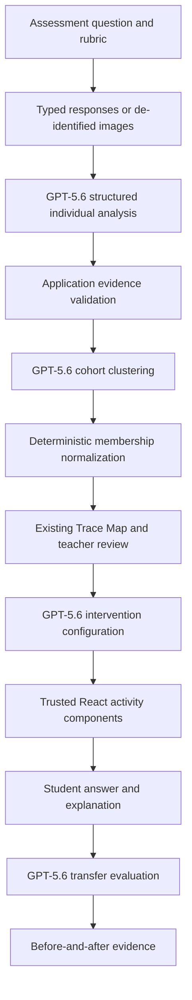

# ClassTrace

**See how your class is thinking.**

ClassTrace is misconception intelligence for teachers. It reconstructs observable reasoning across responses to one question, discovers shared possible misconceptions, supports teacher review, configures targeted interventions, and evaluates whether the reasoning transfers to a new problem.

The main experience is a teacher-facing reasoning instrument—not a chatbot.

## Architecture



OpenAI requests run only from Node.js API routes. The browser stores validated structured results and teacher edits in `localStorage`; uploaded image bytes are never persisted.

The live class workflow uses four bounded requests:

1. One class-wide request reconstructs observable reasoning for up to 12 responses.
2. One request clusters the validated individual analyses by shared reasoning evidence.
3. One request configures an intervention after the teacher chooses a cluster.
4. One request evaluates a submitted transfer answer and explanation.

All requests use the Responses API, `model: "gpt-5.6"`, `store: false`, Zod schemas, `zodTextFormat`, `responses.parse`, and a 150-second SDK timeout. Automatic SDK retries are disabled so a failed request cannot silently duplicate an analysis; the class pipeline permits one explicit, missing-response-only repair request.

## Phase 1 and Phase 2

Phase 1 established the premium responsive interface, deterministic synthetic class, signature Trace Map, teacher workbench, circle explorer, student activity, and prepared outcomes.

Phase 2 adds:

- server-only GPT-5.6 Responses API integration;
- structured multimodal analysis for typed work and PNG, JPEG, or WebP images;
- real application-stage NDJSON progress;
- verbatim evidence verification and confidence thresholds;
- deterministic cluster-membership normalization;
- visible live/prepared provenance;
- locally persisted approval, rename, move, review, merge, and restore controls;
- validated intervention configuration rendered by trusted components;
- live transfer evaluation based on answer and explanation;
- safe, copyable JSON evidence export;
- offline tests and an optional live evaluation harness.

The prepared demonstration remains available without an API key and never silently replaces a failed live run.

## Setup

Requirements: Node.js 20.9 or newer and npm.

```bash
npm install
cp .env.example .env.local
npm run dev
```

Open [http://localhost:3000](http://localhost:3000).

Environment variables:

```bash
OPENAI_API_KEY=
NEXT_PUBLIC_APP_URL=http://localhost:3000
```

`OPENAI_API_KEY` is read only by server modules. The build and prepared demonstration do not require it.

## Live and prepared modes

- **Live analysis · GPT-5.6:** sends the supplied assessment and de-identified responses to the OpenAI Responses API and renders validated results in the existing Trace Map.
- **Prepared demonstration · deterministic data:** uses the bundled 12-learner synthetic fixture and makes no model call.

From `/assessments/new`, choose **Load sample inputs** followed by **Analyse with GPT-5.6** to run the synthetic class live. Choose **Open prepared demonstration** for the offline story.

## Demo flow

- `/` — product overview and Trace Map preview
- `/assessments/new` — assessment, rubric, typed responses, image uploads, live progress and recoverable errors
- `/analyses/demo` — deterministic analysis
- `/analyses/live` — current validated live run
- `/analyses/live/clusters/[clusterId]` — evidence and teacher adjustments
- `/interventions/live` — GPT-5.6 configuration and teacher approval
- `/learn/live` — trusted student activity and live transfer submission
- `/analyses/live/outcomes` — transfer evidence and teacher recommendation

The strongest quick demo is documented at the end of this README.

## Privacy and product boundaries

- Use synthetic or de-identified student work for this demonstration.
- Fixtures use aliases such as `Learner 01`; they contain no real student data.
- Images are validated in memory, sent directly for analysis, and not persisted by ClassTrace.
- Raw image contents, prompts, API keys, and raw OpenAI responses are not logged or returned to the browser.
- Student work is treated as untrusted content and is isolated with explicit prompt boundaries.
- Exact evidence excerpts must occur verbatim in the supplied work or the run is rejected.
- Low-confidence and unreadable work requires teacher review.
- ClassTrace suggests possible reasoning patterns. Teachers remain responsible for instructional decisions.
- The product never diagnoses intelligence, medical, psychological, behavioural, or neurodevelopmental conditions.

## Structured outputs

The server validates:

- individual submission analyses, including readability, observable reasoning, verbatim evidence, alternatives, confidence, and review status;
- cohort clusters, demonstrated understanding, teacher attention, intervention recommendation, and calculated summary counts;
- a discriminated intervention union for circle explorer, comparison activity, worked example, or teacher review;
- transfer status: `resolved`, `partially_resolved`, `unresolved`, or `uncertain`.

Intervention output is configuration data only. ClassTrace rejects executable code, scripts, HTML, CSS, JSX, event handlers, and JavaScript URLs.

## Quality checks and evaluation

```bash
npm run lint
npm test
npm run build
npm run eval:classtrace
```

The default test suite is offline and does not require an API key. `npm run eval:classtrace` always runs structural checks against the synthetic class. When `OPENAI_API_KEY` is present, it additionally runs the two-stage sample analysis with GPT-5.6.

The evaluation verifies representation of all 12 responses, duplicate membership, evidence presence, review thresholds, major prepared reasoning patterns, schema validity, and non-executable intervention output. It is a small hackathon evaluation, not a claim of general pedagogical validity; broader subjects, handwriting conditions, languages, and ambiguous work require further evaluation with educators.

Three consecutive live evaluation runs completed in **90.513 s**, **84.079 s**, and **82.633 s** (observed range **82.6–90.5 s**). Those measurements validate the two-stage synthetic class pipeline under the tested account and network conditions; they are not a latency guarantee. A later final browser pass reached the streamed reasoning stage but was blocked by an account-quota `429`; the UI exposes the failure rather than substituting fixture data, and distinguishes non-retryable quota exhaustion from a transient rate limit.

Playwright-ready navigation tests are available with:

```bash
npx playwright install chromium
npm run test:e2e
```

## Vercel deployment

1. Push this repository to a Git provider.
2. Import the repository into Vercel as a Next.js project.
3. Set `OPENAI_API_KEY` as a protected server environment variable for Production and Preview.
4. Set `NEXT_PUBLIC_APP_URL` to the deployed HTTPS origin.
5. Deploy using the standard Next.js build command, `npm run build`.
6. Ensure the selected Vercel plan permits the declared 180-second Node.js function duration.
7. Verify `/analyses/demo` without an API key and then run a de-identified live analysis with the configured key.
8. Confirm streamed NDJSON reaches the browser through the deployed edge path and that the live result carries the GPT-5.6 provenance badge.
9. Generate and approve one intervention, submit one transfer response, and inspect the evidence export for secrets or image data.

No Cloudflare Workers or Sites adapter is used.

## Current limitations

- The assessment draft is stored under `classtrace:v1:assessment-draft`; the latest completed live run, teacher edits, approved intervention, transfer evaluation, and duplicate-analysis fingerprint are stored as one validated snapshot under `classtrace:v1:latest-analysis`.
- Persistence is browser-local for the current production origin. It survives refreshes, browser restarts, navigation, and normal same-domain Vercel redeployments, but it is not available across devices or browsers.
- Clearing browser storage removes saved drafts and analyses. There is no server backup.
- Uploaded image names, MIME types, sizes, and last-modified timestamps may be retained with a draft, but image bytes, `File` objects, Base64 data, and object URLs are never stored. Images must be reattached before a new analysis.
- There is no authentication, database, class roster, or cross-device persistence.
- The MVP accepts at most 12 responses and 5 MB per image.
- Only the circle-area intervention is deeply interactive; other intervention types render structured teacher-reviewed cards.
- A live transfer outcome represents the completed learner submission on this device rather than an entire class re-assessment batch.
- Image quality and handwriting legibility still affect evidence quality; unreadable work is routed to teacher attention.
- The optional live evaluation depends on account access to the `gpt-5.6` alias and consumes API usage.
- Production uses concurrent 95-second primary analysis batches with one bounded concurrent 30-second fallback for only a timed-out group, plus reserved repair and clustering budgets below the route's 180-second duration. Production deployment should continue monitoring latency.

## How Codex and GPT-5.6 contributed

Codex helped implement:

- application architecture;
- typed schemas;
- OpenAI integration;
- streaming orchestration;
- UI components;
- tests;
- accessibility;
- error handling;
- evaluation tooling.

The builder personally defined:

- the teacher-first product direction;
- misconception-evidence requirements;
- human-review boundaries;
- visual direction;
- supported concept scope;
- intervention workflow;
- submission story.

GPT-5.6 performs at runtime:

- multimodal student-work interpretation;
- observable reasoning reconstruction;
- possible misconception hypotheses;
- cohort pattern discovery;
- intervention configuration;
- transfer evaluation.

Codex /feedback session ID: **[add before submission]**

## Build Week evidence

The repository contains the complete product implementation, explicit model alias, structured schemas, server-only request modules, streaming endpoint, deterministic fallback, teacher-edit store, intervention renderer, transfer evaluator, tests, evaluation command, and this implementation record. Git history and the Codex `/feedback` session can be included as supporting submission evidence.

## Strongest three-minute demo

1. **0:00–0:25 — Frame the problem.** Open `/assessments/new`, state “See how your class is thinking,” load the 12-response synthetic sample, and point out typed/image privacy guidance.
2. **0:25–0:50 — Start live analysis.** Select **Analyse with GPT-5.6**. Narrate the seven streamed application stages, the active elapsed timer, and the one-to-two-minute expectation. Use a previously completed live run for a time-bounded stage presentation if the current call is still processing; never label the prepared mode as live.
3. **0:50–1:25 — Read the Trace Map.** On `/analyses/live`, show the live GPT-5.6 provenance, 12 unique memberships, and why matching wrong answers can follow different evidence-grounded reasoning paths.
4. **1:25–1:55 — Keep the teacher in control.** Open a cluster, compare an exact excerpt with the submitted response, show confidence and an alternative hypothesis, then approve, rename, or move one response. Restore the AI result to demonstrate reversibility.
5. **1:55–2:25 — Turn evidence into action.** Generate a circle-area configuration, explain that executable model output is rejected, approve it, and open the trusted student renderer. Change the radius with keyboard controls and show area scaling update from the actual input.
6. **2:25–2:50 — Verify transfer.** Submit a concise answer plus conceptual explanation. Show that GPT-5.6 evaluates reasoning, can preserve uncertainty, and routes confidence below 70% to teacher review.
7. **2:50–3:00 — Close with evidence.** Open outcomes, emphasize that this is one completed transfer check—not whole-class improvement—and copy the safe JSON evidence package.
