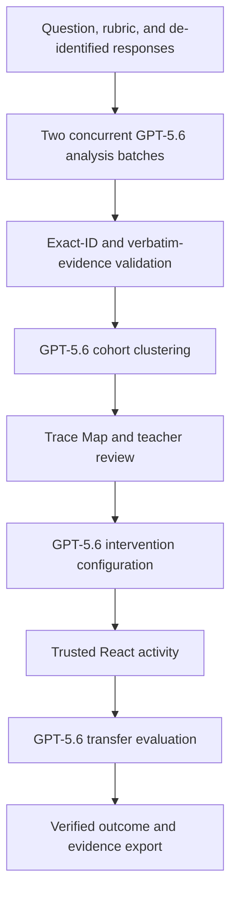

# ClassTrace

> **See how your class is thinking.**

ClassTrace analyses student work, identifies evidence-grounded reasoning patterns, helps teachers approve targeted interventions, and verifies whether understanding transfers to a new problem.

[Live application](https://class-trace-one.vercel.app) · [GitHub repository](https://github.com/Rex739/ClassTrace) · **Demo video:** [ADD PUBLIC YOUTUBE URL] · **OpenAI Build Week / Devpost:** [ADD SUBMISSION URL]

## The problem

Teachers can often see which answers are incorrect, but not quickly determine why each learner arrived there. Similar final answers can come from different reasoning paths, while different answers can share the same underlying break. Treating every wrong answer alike can therefore lead to ineffective reteaching.

## The solution

ClassTrace accepts a question, a reasoning guide, and de-identified student responses. GPT-5.6 reconstructs observable reasoning, proposes possible misconception patterns, and groups responses by shared evidence rather than answer matching alone.

Teachers can inspect exact excerpts, confidence, and alternative hypotheses before approving or adjusting any result. ClassTrace then configures a targeted intervention, renders it through trusted React components, and evaluates whether a learner can transfer the concept to a new problem—not merely repeat a correct final answer.

ClassTrace does not diagnose intelligence, ability, or medical, psychological, behavioural, or neurodevelopmental conditions. It supports teacher judgement; it does not replace it.

## Core product flow

```text
Assessment setup
  → GPT-5.6 response analysis
  → evidence-grounded Trace Map
  → teacher review
  → targeted intervention
  → learner transfer check
  → verified outcome
```

## Key features

- Typed and image-based student work using de-identified learner labels.
- Two concurrent, request-specific GPT-5.6 analysis batches for the 12-response sample.
- Exact response-ID membership and verbatim evidence validation.
- Reasoning-based cohort clustering and the signature Trace Map.
- Confidence, insufficient-evidence handling, and alternative hypotheses.
- Teacher controls to approve, rename, move, merge, review, and restore results.
- Validated structured intervention configurations instead of model-generated code.
- Trusted React activity rendering with teacher approval before learner access.
- Prediction, exploration, explanation, and transfer stages.
- GPT-5.6 transfer evaluation that considers conceptual reasoning, not only correctness.
- Clear live-versus-prepared provenance and a safe JSON evidence export.
- Versioned browser-local persistence and duplicate-analysis fingerprint protection.
- Responsive, keyboard-accessible desktop and mobile interfaces.
- An instant deterministic demonstration using 12 synthetic responses.

## Demo

- **Live app:** [https://class-trace-one.vercel.app](https://class-trace-one.vercel.app)
- **Demo video:** [ADD PUBLIC YOUTUBE URL]

Reviewers can open the prepared demonstration instantly without an OpenAI call. Live mode uses **Analyse with GPT-5.6** to perform a real structured analysis and may take approximately one to two minutes.

1. Load the sample circle-area assessment.
2. Open the prepared analysis or run the sample live.
3. Inspect the Trace Map and a learner’s response evidence.
4. Approve or adjust a reasoning pattern, then open the intervention.
5. Complete the learner transfer check.
6. Review the outcome and copy the JSON evidence export.

## Architecture



### Frontend

- Next.js App Router and React
- strict TypeScript
- Tailwind CSS and application design tokens
- trusted React intervention components
- versioned, Zod-validated `localStorage` persistence

### AI workflow

- OpenAI Responses API with `gpt-5.6`
- Structured Outputs using Zod and `zodTextFormat`
- two concurrent six-response primary batches for the sample class
- medium reasoning effort and SDK retries disabled
- one bounded timeout fallback that splits only a timed-out six-response group into two concurrent three-response groups
- cohort clustering after individual results pass validation
- structured intervention generation and transfer evaluation

Primary analysis batches have a 95-second application timeout. If exactly one primary batch times out, its two fallback requests each have a 30-second timeout; the completed primary batch is retained. Clustering has its own bounded timeout, and the analysis route declares a 180-second Node.js duration.

### Validation boundaries

- Request-specific schemas preserve the exact expected response IDs.
- Global normalization rejects duplicate or missing membership.
- Evidence excerpts must occur verbatim in the supplied work.
- Low confidence and insufficient evidence can require teacher review.
- Unreadable work is represented rather than silently omitted.
- Executable intervention output is rejected; no arbitrary model-generated code runs.

## How GPT-5.6 is used

GPT-5.6 performs:

- multimodal student-work interpretation;
- observable reasoning reconstruction;
- possible misconception hypotheses;
- evidence-grounded cohort clustering;
- intervention configuration; and
- transfer evaluation.

GPT-5.6 does not make final instructional decisions. Teachers inspect evidence, revise groupings, approve interventions, and decide what action is appropriate for their learners.

## How Codex contributed

Codex helped implement:

- application architecture;
- typed schemas and validation;
- OpenAI integration and streaming orchestration;
- timeout and recovery logic;
- browser-local persistence and duplicate-cost protection;
- UI components and responsive states;
- automated tests and accessibility checks;
- deployment readiness; and
- documentation.

**Codex /feedback Session ID:** `019f7531-78d4-77a2-9922-0e7a9aa22d5b`

## Builder decisions

The builder personally defined:

- the teacher-first product direction;
- the ClassTrace concept and scope;
- evidence requirements and teacher-control boundaries;
- the end-to-end product flow;
- the visual direction;
- the circle-area demonstration scenario;
- privacy rules; and
- the submission story.

## Privacy, safety, and teacher control

- Use only synthetic or de-identified student work.
- Fixtures use labels such as `Learner 01` and contain no real student data.
- Uploaded images are held only for the live request and are not persisted.
- Image bytes, Base64 content, `File` objects, and object URLs are excluded from browser storage and evidence exports.
- Student text is treated as untrusted content and cannot change the analysis task.
- ClassTrace suggests possible reasoning patterns; teachers remain responsible for instructional decisions.
- Low-confidence, ambiguous, or insufficient-evidence work can be routed to teacher review.
- Model output configures a fixed set of trusted components; arbitrary generated code is never executed.

## Live and prepared modes

### Prepared demonstration

- deterministic and immediate;
- uses the bundled synthetic class;
- makes no OpenAI request; and
- is suitable for reviewers without an API key.

### Live analysis

- powered by GPT-5.6;
- validates evidence and response membership before rendering;
- includes model, timestamp, run ID, and review provenance;
- typically takes approximately one to two minutes, although model latency varies; and
- requires a server-side `OPENAI_API_KEY`.

A failed live run is never silently replaced with prepared results.

## Persistence and duplicate-cost protection

ClassTrace stores an assessment draft under `classtrace:v1:assessment-draft` and the latest completed analysis snapshot under `classtrace:v1:latest-analysis`. The saved snapshot contains the validated run, teacher edits, approved intervention, transfer evaluation, and assessment fingerprint.

Saved analyses can be resumed after refresh, navigation, or a browser restart without another OpenAI request. Before starting an identical live assessment, ClassTrace computes a SHA-256 fingerprint from the question, rubric, ordered typed responses, and safe image descriptors. It offers the existing result first; only **Run a new analysis anyway** starts another paid request.

Persistence is browser- and origin-local, not cross-device. Clearing browser storage removes saved work. Image files themselves are not retained and must be reattached.

## Local setup

Requirements: Node.js 20.9 or newer and npm.

```bash
git clone https://github.com/Rex739/ClassTrace.git
cd ClassTrace
npm install
cp .env.example .env.local
npm run dev
```

Open [http://localhost:3000](http://localhost:3000).

## Environment variables

```bash
OPENAI_API_KEY=
NEXT_PUBLIC_APP_URL=http://localhost:3000
```

`OPENAI_API_KEY` is read only by server modules and must never be exposed to browser code. Use the complete deployed HTTPS origin for `NEXT_PUBLIC_APP_URL` in production.

## Testing and evaluation

```bash
npm run lint
npm test
npm run build
npm run test:e2e
npm run eval:classtrace
```

The normal unit and Playwright suites are offline and do not require an API key. The current repository suite contains **61 unit tests** and **20 Playwright cases** across desktop and mobile projects.

`npm run eval:classtrace` always performs structural checks against the synthetic class. With `OPENAI_API_KEY` configured, it additionally runs the live GPT-5.6 evaluation, consumes API credit, and can take several minutes. The prepared demonstration and normal test suites remain available without a key.

If Playwright’s Chromium browser is not already installed:

```bash
npx playwright install chromium
```

## Verified live scenario

The final circle-area playground scenario produced:

- 12 responses analysed exactly once;
- 5 possible misconception clusters;
- 2 responses showing demonstrated understanding;
- a targeted linear-scaling misconception;
- a teacher-approved circle-area intervention; and
- one transfer result resolved at 99% confidence.

This is evidence from one completed learner transfer check. It does not establish whole-class learning improvement or broad pedagogical validity.

## Vercel deployment

1. Import the GitHub repository into Vercel as a Next.js project.
2. Add `OPENAI_API_KEY` as a protected Production and Preview variable.
3. Set `NEXT_PUBLIC_APP_URL` to the complete deployed HTTPS origin.
4. Confirm the plan supports the declared 180-second Node.js function duration.
5. Deploy with the standard Next.js build command.
6. Verify the prepared demonstration without an API key dependency.
7. Run one de-identified production live smoke test and confirm provenance, streaming progress, and evidence export.

The analysis routes use bounded request timeouts and a single application-level timeout fallback. Production latency can still vary with model load, network conditions, and account quota.

## Current limitations

- Persistence is browser-local; there is no authentication, database, server backup, or cross-device synchronization.
- Only one latest completed analysis is retained per browser origin.
- Clearing browser storage removes drafts and saved analyses.
- Uploaded images must be reattached for a new run.
- The MVP accepts up to 12 responses, with a maximum of 5 MB per image.
- The circle-area explorer is the deeply interactive intervention example; other validated intervention types render structured teacher-reviewed activities.
- Broader subjects, languages, handwriting conditions, and ambiguous work require further educator-led evaluation.
- Model latency, account quota, and model access can affect live mode.
- One learner’s transfer result does not represent the whole class.

## License

No license file is currently included. Usage and redistribution terms have not yet been specified.
